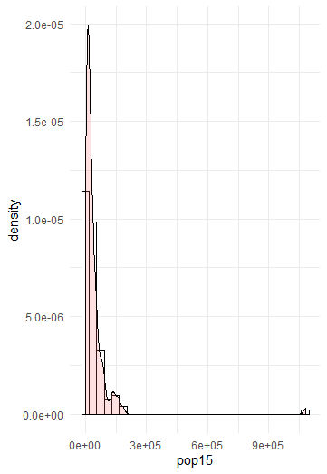
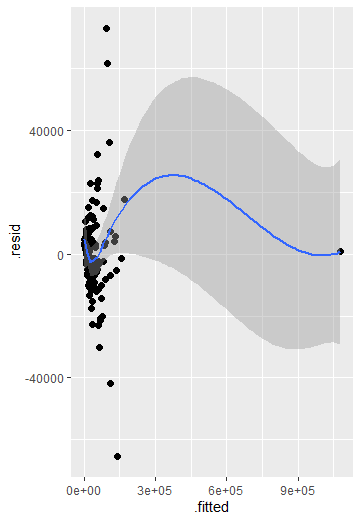
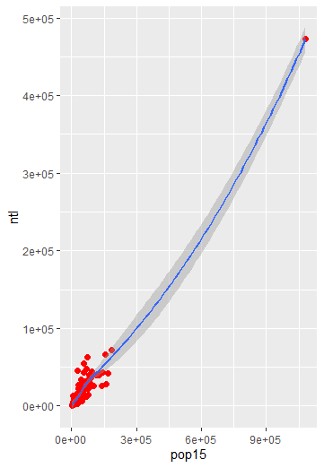
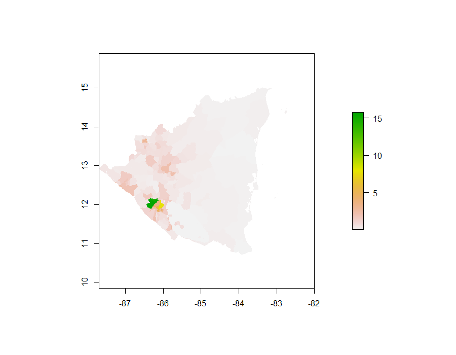
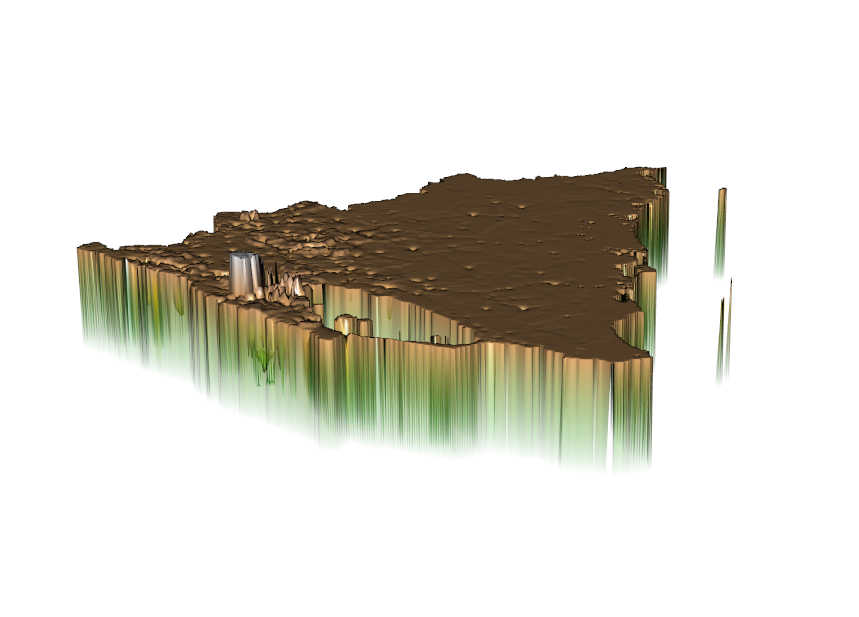
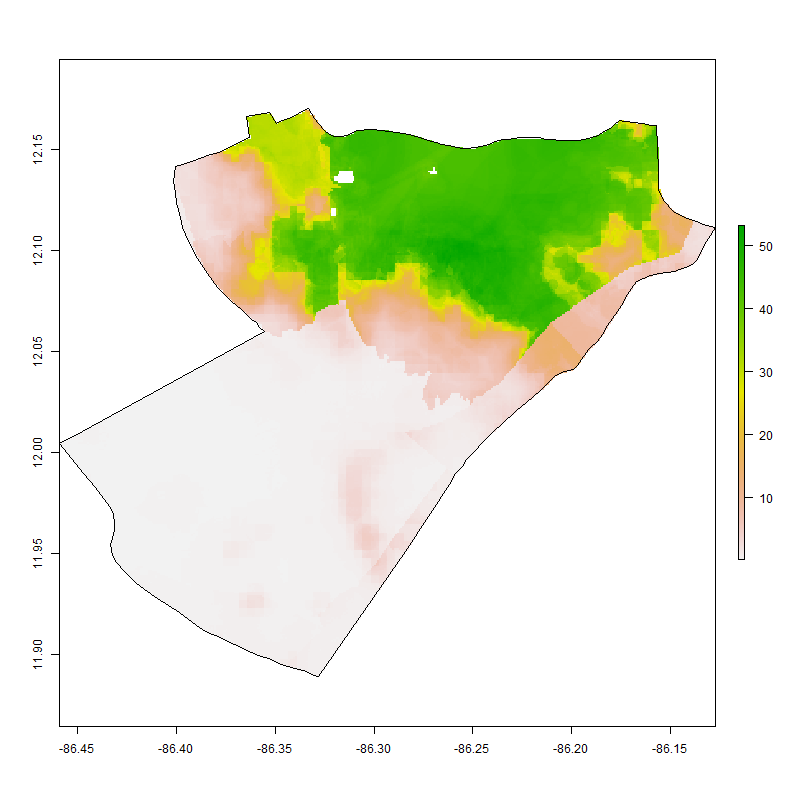
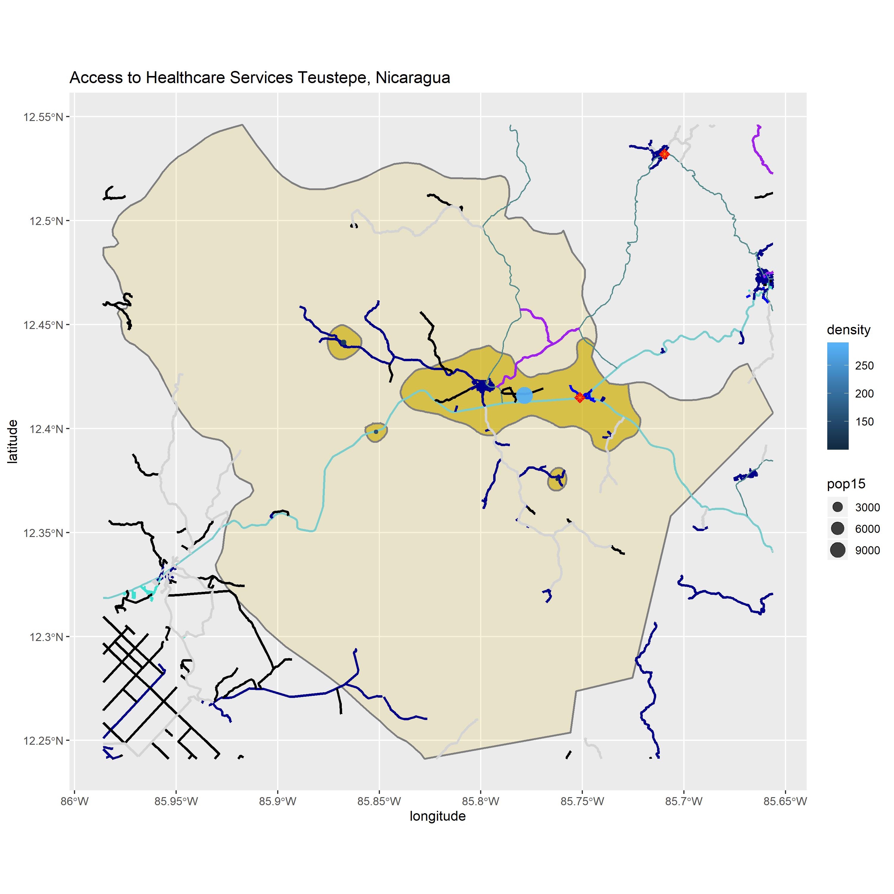
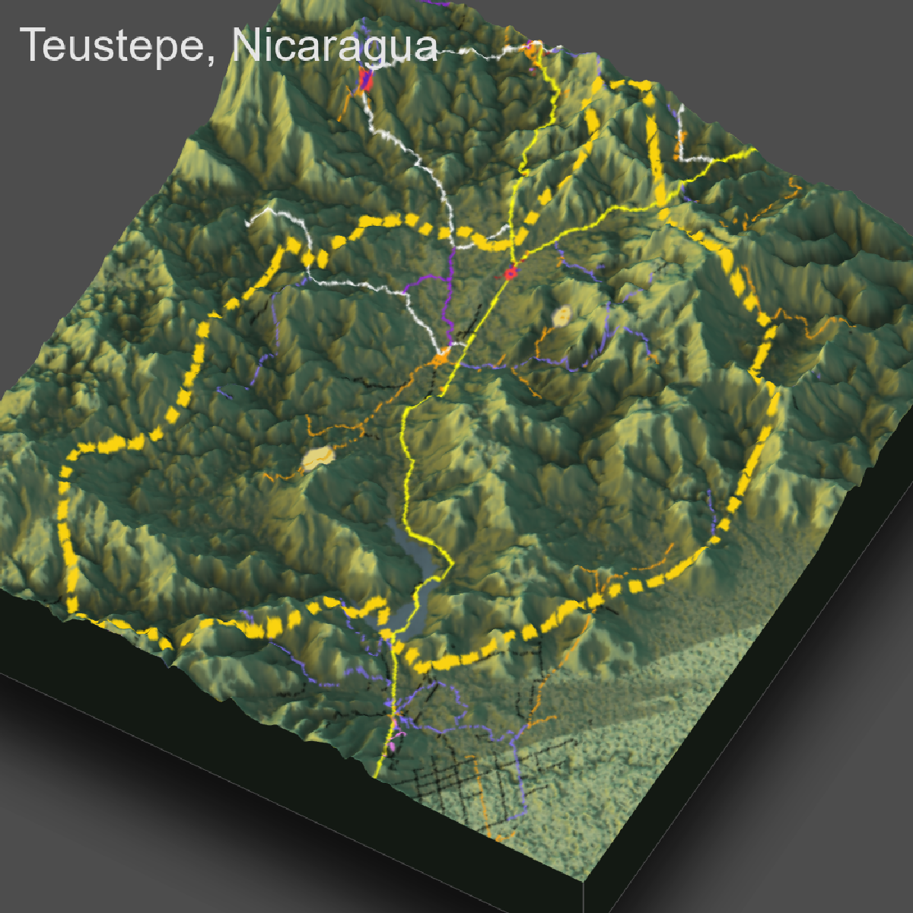
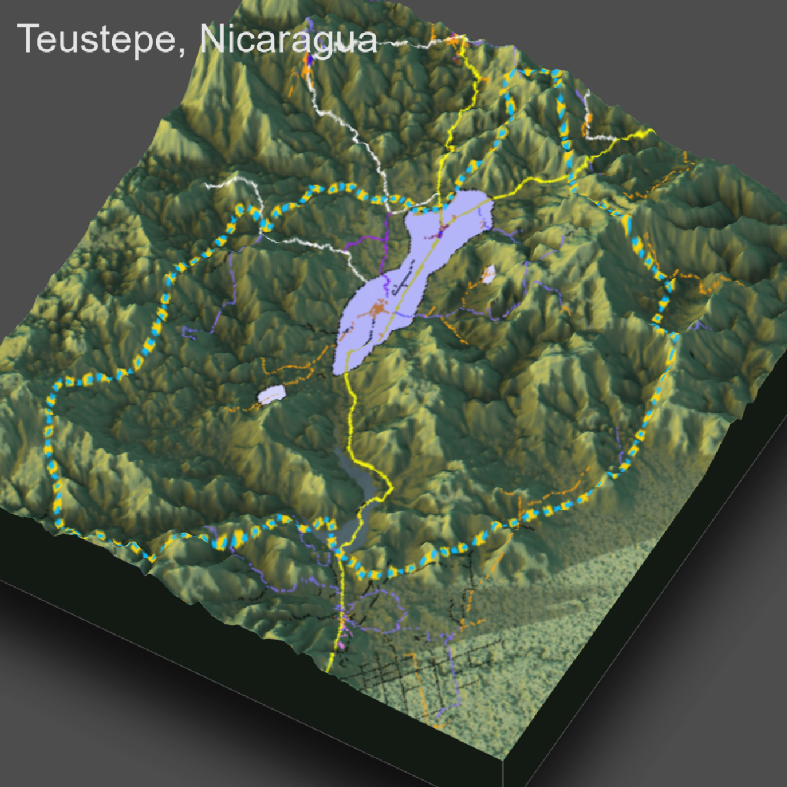

# Nicaragua

This is a spatial description of Nicaragua 

## Administrative Subdivisions of Nicaragua

This plot identifies all of the Departments of Nicaragua (adm1) and their subdivisions (adm2).

This plot highlights the subdivisions that will be explained further on this page.

## Population Density Throughout Nicaragua

Based on this graphic, it can be seen that most of the population of Nicaragua is concentrated in the western part of the country in the Department of Managua. Within Managua is the capital and has around 24% of the total population of the country.

This plot shows the centralized density of people within Managua.

This graphic describes the population distribution accross the country using an overlay of two logarithmic models.

A linear fit was then used to describe the population overland, it illustrates that most of the population resides on the western part of the country and has a small outlier in the east.

Only using night time lights to descibe land use/ land cover yeilds this result.

This map shows the sum of the population of Nicaragua distributed throughout the country, with most of the population being shown in the municiplaity of Managua

A Three-Dimensional plot of population sums was generated to show how much larger the density is in Managua versus other parts of the country. The large hole in the plot is a large lake.

## Administrative Subdivisions Comparison

### Population Density in Managua

### Population Density in Teustepe
.png)

Between the two plots, it is evident by the difference in their color scales that Managua has a much larger concentraion of people. Managua and Teustepe have similar land areas, the developement of the land however is much different. Managua is almost exlusively urbanized with a populatio of just over 1.2 million people; conversely Teustepe has a population of 36,000 people with only two vastly smaller 'urban' areas.

## Assessment of Healthcare, Transportation, and Human Developement

| District | Urban Populations | Roadways | Healthcare Facilities |
| :--------: | :-----------------: | :--------: | :---------------------: |
| Teustepe | Largest Pop: 11,643 ppl | 463056.2 m of road | 2 Hospitals, 16,151 ppl/facility |

