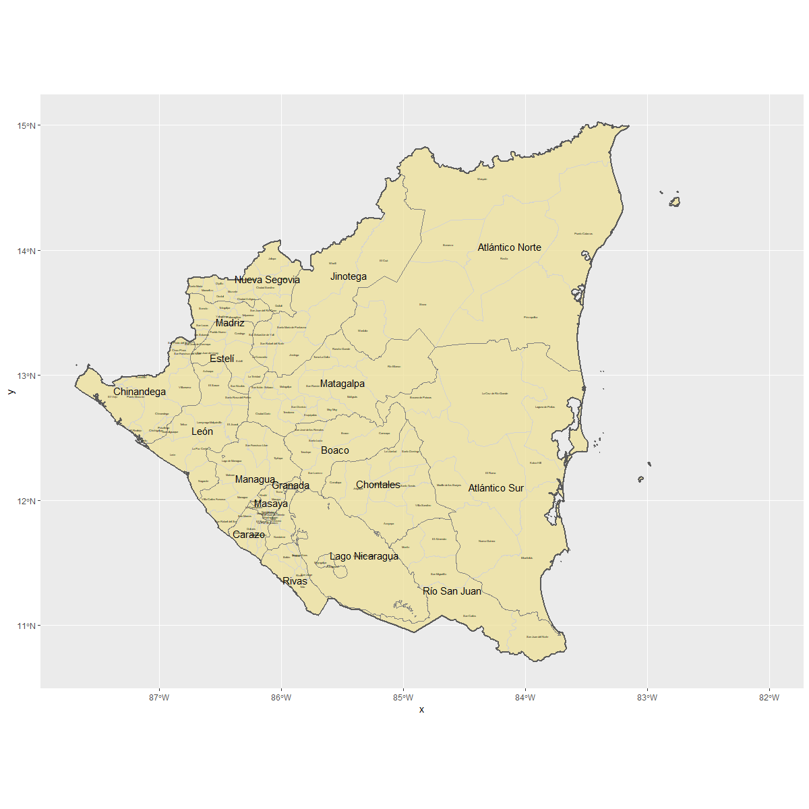

# Nicaragua

This is an overview of a spatial description of Nicaragua 

## Administrative Subdivisions of Nicaragua

This plot identifies all of the Departments of Nicaragua (adm1) and their subdivisions (adm2).

This plot highlights the subdivisions that will be explained further on this page.

## Population Density Throughout Nicaragua

## Administrative Subdivisions Comparison

.png)

## Assessment of Healthcare, Transportation, and Human Developement

